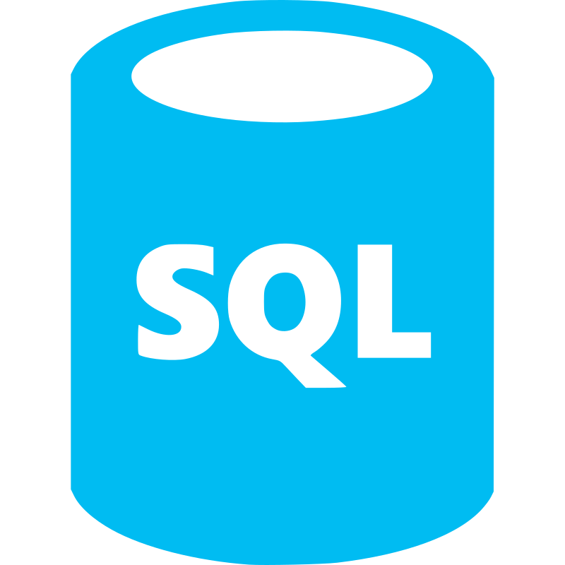
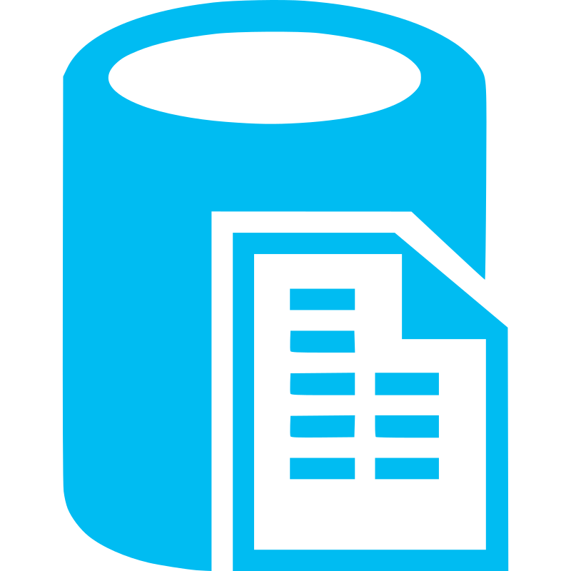

# Hi I'm Josh! 👋

I am a highly motivated Software Engineer focused on delivering scalable, reliable software. I am passionte about learning how things work "under the hood" and solving problems. Currently, I design, build, and deploy web-based APIs in a fast-paced, agile development environment. I have expertise in programming languages such as Rust, Python, and Node.js. I also have a solid understanding of business areas through working with internal stakeholders. I am a dedicated team player with technical depth and a drive to deliver exceptional end products for clients.

Technologies I am particularly passionate about are Rust and Linux. Rust is newer to me, but I am using it extensively for it's memory safety features and high performance, while still delivering high-level programming capabilities. Linux has been with me for years due to it's high customizability. I have had hands on experience with nearly every component of the operating system, from the boot process to networking.

## Projects

**Docker Ruby on Rails Template** - [GitHub](https://github.com/joshua-holmes/docker-template-ruby-on-rails)

Serves as a template that will allow you to toss your Ruby on Rails (can optionally include React frontend) application into a folder, configure a few settings, then quickly have a Dockerized app with it's own contained environment!

**Unoffical Linux BeamMP Installer** - [GitHub](https://github.com/joshua-holmes/beammp-installer)

Welcome to the Unoffical Linux BeamMP Installer! This program automates the installation of the BeamNG multiplayer mod, BeamMP, on Linux using Proton, since the mod is natively available for Windows only.

## Skills

  
  
  
  
  
  
  
  
  
  
  
  
  
  
  
  
  
  
  
  
  
  

 

## Get in Touch

